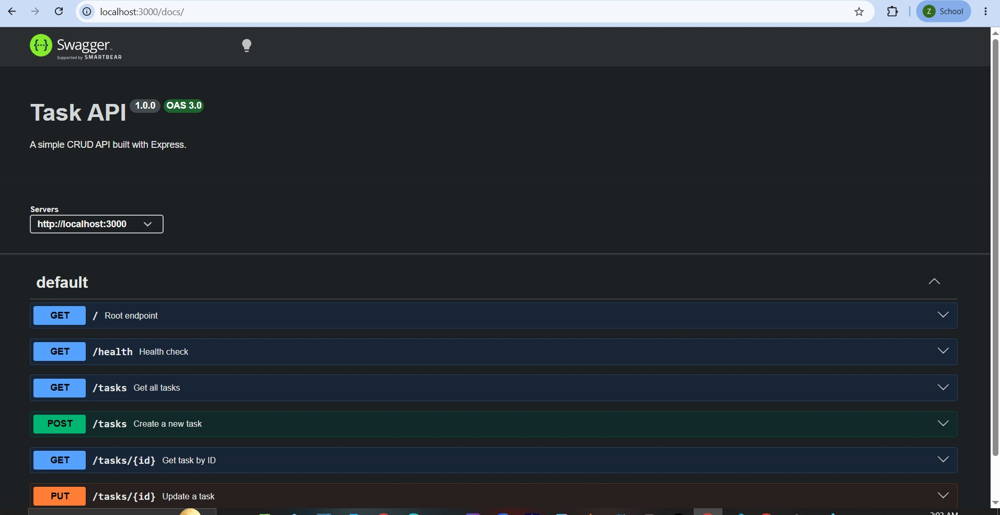
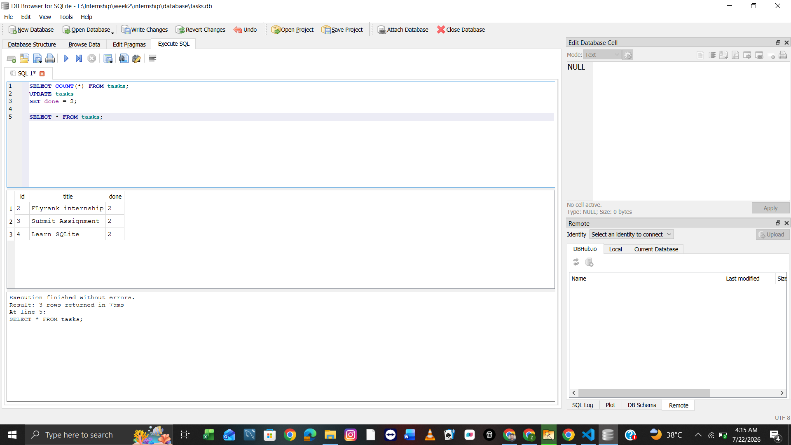

# Task Manager API

A simple RESTful Task Manager API built with **Node.js**, **Express.js**, **SQLite**, and **Swagger UI** as part of the **FlyRank Backend AI Engineering Internship**.

The project demonstrates how to build a CRUD API with persistent data storage using SQLite while documenting the API using OpenAPI (Swagger).

---

# Features

- Create a new task
- Get all tasks
- Get a task by ID
- Update an existing task
- Delete a task
- Health check endpoint
- Persistent task storage using SQLite
- Automatic database and table creation
- Automatic insertion of sample tasks on first run
- Interactive Swagger API documentation
- Input validation with proper HTTP status codes

---

# Technologies Used

- Node.js
- Express.js
- SQLite
- sqlite3
- Swagger UI Express
- OpenAPI 3.0 (YAML)

---

# Why SQLite?

SQLite was chosen because it is a lightweight, serverless relational database that stores data in a single file.

It is perfect for learning backend development because:

- No database server installation is required.
- Easy to set up.
- Fast and lightweight.
- Data persists even after restarting the server.

---

# Installation

## Clone the repository

```bash
git clone https://github.com/ZahidHussain775/task-manager-api.git
```

## Navigate into the project

```bash
cd task-manager-api
```

## Install dependencies

```bash
npm install
```

---

# Run the Application

Start the server:

```bash
npm start
```

or

```bash
node app.js
```

The application will run on:

```
http://localhost:3000
```

---

# Security & Configuration

| Variable | Description |
|----------|-------------|
| `API_KEY` | Optional. When set, all mutating endpoints (`POST`, `PUT`, `DELETE`) require a matching `x-api-key` request header. When unset, those endpoints stay open (a warning is logged on startup). |

Additional hardening included:

- **Security headers** via `helmet`.
- **Strict input validation**: `title` must be a non-empty string (max 255 chars), `done` must be a boolean, and task ids must be positive integers.
- **Parameterized SQL** for every query (no string concatenation), preventing SQL injection.
- **Generic 500 responses** — internal error details are logged server-side, not returned to clients.
- **Request body size limit** of 16kb.

Example authenticated request:

```bash
curl -X POST http://localhost:3000/tasks \
  -H "Content-Type: application/json" \
  -H "x-api-key: $API_KEY" \
  -d '{"title": "Buy milk"}'
```

---

# Database

The application automatically creates the SQLite database on the first run.

Database location:

```text
database/tasks.db
```

When the server starts it will automatically:

- Create the database if it does not exist.
- Create the `tasks` table if it does not exist.
- Insert three sample tasks only when the table is empty.

This ensures that restarting the server does not create duplicate data.

---

# API Documentation

Swagger documentation is available at:

```
http://localhost:3000/docs
```

---

# API Endpoints

| Method | Endpoint | Description |
|---------|----------|-------------|
| GET | `/` | Root endpoint |
| GET | `/health` | Health check |
| GET | `/tasks` | Get all tasks |
| GET | `/tasks/:id` | Get task by ID |
| POST | `/tasks` | Create a new task |
| PUT | `/tasks/:id` | Update a task |
| DELETE | `/tasks/:id` | Delete a task |

---

# Example Requests

## Create a Task

**POST** `/tasks`

Request Body

```json
{
  "title": "Buy milk"
}
```

Response

```json
{
  "id": 4,
  "title": "Buy milk",
  "done": 0
}
```

---

## Get All Tasks

**GET** `/tasks`

Example Response

```json
[
  {
    "id": 1,
    "title": "Learn Express",
    "done": 0
  },
  {
    "id": 2,
    "title": "Build CRUD API",
    "done": 0
  },
  {
    "id": 3,
    "title": "Submit Assignment",
    "done": 1
  }
]
```

---

# HTTP Status Codes

| Status Code | Description |
|-------------|-------------|
| 200 | Successful request |
| 201 | Resource created |
| 204 | Resource deleted successfully |
| 400 | Invalid request |
| 404 | Resource not found |
| 500 | Internal server error |

---

# Example SQL Query

The following SQL query returns all tasks stored in the database:

```sql
SELECT * FROM tasks;
```

Another useful query to count tasks:

```sql
SELECT COUNT(*) FROM tasks;
```

---

# Project Structure

```text
task-manager-api/
│
├── database/
│   ├── db.js
│   └── tasks.db
│
├── app.js
├── openapi.yaml
├── package.json
├── package-lock.json
├── .gitignore
├── README.md
└── swagger.jpg
```

---

# Screenshots

## Swagger UI

Save your Swagger screenshot as:

swagger.jpg

markdown



---

## SQLite Database

Open `database/tasks.db` using **DB Browser for SQLite** and save a screenshot as:

```
database-viewer.png
```

markdown



# Sample Task Object

```json
{
  "id": 1,
  "title": "Learn Express",
  "done": 0
}
```

---

# Future Improvements

- Search tasks using SQL (`LIKE`)
- Filter completed tasks
- Sort tasks alphabetically
- Add timestamps (`created_at`, `updated_at`)
- Add authentication
- Migrate to PostgreSQL or MySQL

---

# Author

**Zahid Hussain**

GitHub:

https://github.com/ZahidHussain775

---

# Assignment

This project was completed as part of the **FlyRank Backend AI Engineering Internship**.

The project demonstrates:

- RESTful API development with Express.js
- CRUD operations
- SQLite database integration
- SQL queries
- Persistent data storage
- Request validation
- Proper HTTP status codes
- OpenAPI (Swagger) documentation
- Git & GitHub workflow
